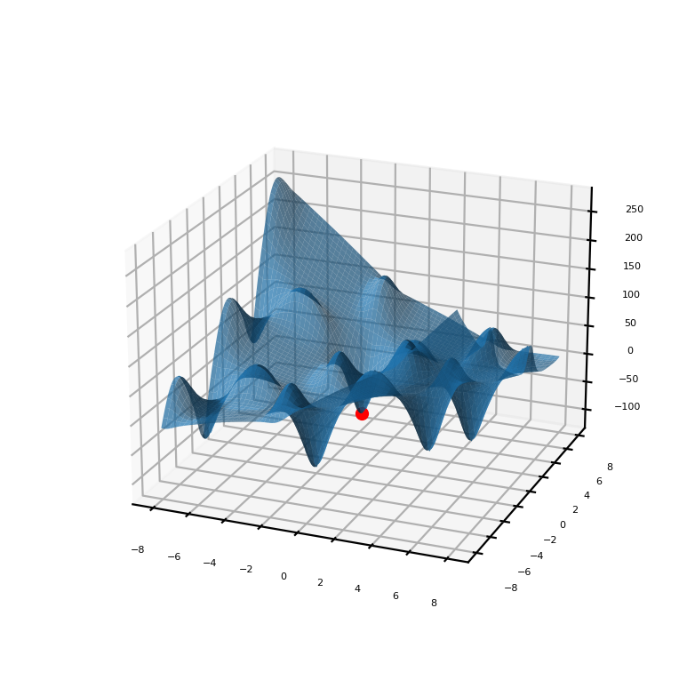

# `gradient optimithation`
### Task and requirements
1. The main goal is to create an algorithm that finds the maximum value modulo the minimum at a given radius.
2. The algorithm must be efficient and work fast enough
3. The result should be displayed on the graph

### Introduction, description of the algorithm
The working area of the function (back interval) is divided into several points. Points of view of minima are chosen. After that, all coordinates are passed to the function as arguments and the argument that gives the smallest value is selected. Adding a gradient method.

### Start program
```bash
$> python gradient.py
```

### Result

